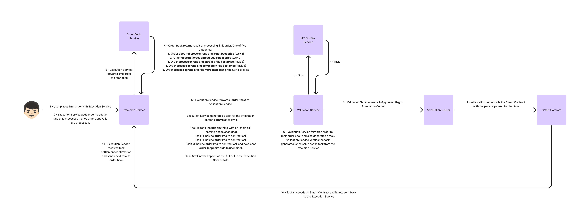
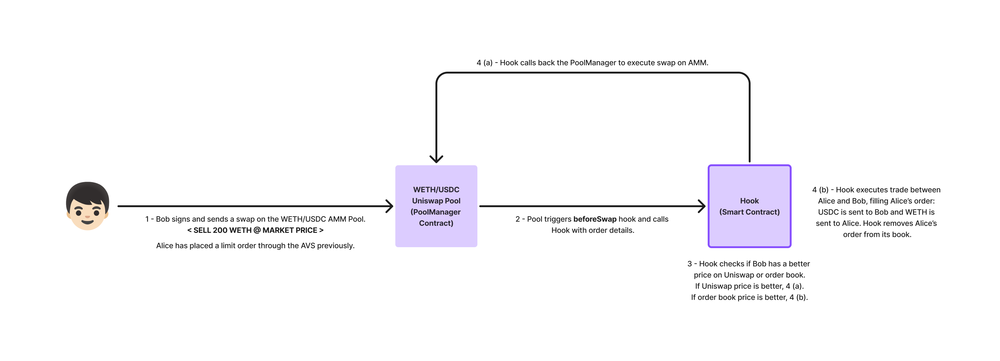

# SwapBook - Bringing TradFi Efficiency On-Chain

DEMO VIDEO for EigenGames submission: [Google Drive](https://drive.google.com/drive/folders/1DG2qO9vtAnXogHjWe0albc-6dTyG0Ri-?usp=sharing).

A decentralized peer-to-peer orderbook system built with EigenLayer's AVS (Autonomous Verifiable Service) using Othentic and Uniswap V4 Hook integration, enabling better execution prices by routing trades between the orderbook and AMMs.

To quickly see how it comes together check out our [Architecture Diagram](assets/InteractionFlow.png), [Placing Order Flow](assets/PlaceOrderFlow.png), and [Uniswap Hook Flow](assets/HookFlow.png).

## Motivation

The reason that TradFi (the largest industry in the world by far) operates on order books rather than AMMs is because they're better. They're more capital-efficient for market makers, provide better prices for traders, and are resistant to AMM flaws like impermanent loss. However, AMMs are the norm on-chain due to the computational intensiveness of running order books, which would cost a fortune in gas fees or just be plain impossible at scale on many chains.

Fortunately, EigenLayer's AVS tech allows you to run computation off-chain and verify its validity through a network of validator nodes, reaching consensus and trustlessly triggering a transaction on-chain with the result of the computation. A perfect use case is order books.

SwapBook is an order book that runs on an AVS and with on-chain settlement. The secret sauce? We use Uniswap V4 hooks to loop into AMMs. When you go to swap on a pool using our hook, before the swap goes through, if you can get a better price on the order book than you can through the pool, our hook reroutes your order to trade with the P2P oroder book instead of the AMM, getting you better prices with lower fees.

## Overview

This project implements a decentralized orderbook system that processes orders off-chain while settling trades on-chain. It leverages EigenLayer's AVS infrastructure for secure off-chain computation and integrates with Uniswap V4 Hooks to offer improved trading between the orderbook and AMMs.

Key features:
- **Decentralized Orderbook**: Maintains order books for token pairs
- **Off-chain Computation**: Processes orders through an AVS network
- **On-chain Settlement**: Securely settles trades on-chain
- **Uniswap V4 Hook Integration**: Route AMM swaps to the orderbook when better prices are available

## Architecture (see diagram [here](assets/InteractionFlow.png))

**Placing an order:**


**Filling an order through Uniswap:**


The system consists of several interconnected services:

1. **Orderbook Service**: Maintains the order book state, matching engine, and order processing logic
2. **Execution Service**: Verifies user signatures, validates actions, and triggers AVS tasks
3. **Validation Service**: Validates task execution from the Execution Service
4. **Smart Contract**: Handles on-chain settlement and escrow management
5. **Frontend Service**: User interface for interacting with the system
6. **Othentic AVS Infrastructure**: Othentics's infrastructure for secure off-chain computation

When a user places an order through the P2P order book:
1. The request is sent to the Execution Service
2. The Execution Service verifies the signature and order validity
3. The Execution Service submits the order to the Orderbook Service
4. The Execution Service triggers a task in the AVS
5. Attester nodes validate the task through the Validation Service
6. Valid tasks are executed on-chain through the smart contract

When a user triggers a swap with a hook-enabled Uniswap V4 pool:
1. The hook catches the order before the swap executes and checks for better pricing in the P2P order book
2. The hook uses this as a market order to directly fill the best priced limit order in the P2P order book

## Prerequisites

- Node.js (>= v22.6.0)
- Docker
- Foundry

## Installation

1. Clone the repository:
   ```bash
   git clone https://github.com/joyhuang9473/swapbook.git
   cd swapbook
   ```

2. Install dependencies:
   ```bash
   # Install Othentic CLI (for AVS)
   npm i -g @othentic/othentic-cli
   ```

3. Create a `.env` file in the root directory using `.env.example` as a template:
   ```bash
   cp .env.example .env
   ```

4. Update the `.env` file with your specific configuration values:
   - Private keys for operators
   - RPC URLs
   - Contract addresses
   - Other required parameters

## Smart Contract Deployment

Deploy the P2POrderBookAvsHook contract (if not already deployed):

```bash
cd contracts/
forge install
forge script script/P2POrderBookAvsHookDeploy.s.sol:P2POrderBookAvsHookDeploy \
 --rpc-url $L2_RPC \
 --private-key $PRIVATE_KEY \
 --broadcast -vvvv \
 --verify \
 --etherscan-api-key $L2_ETHERSCAN_API_KEY \
 --chain $L2_CHAIN \
 --verifier-url $L2_VERIFIER_URL \
 --sig="run(address,address)" \
 $ATTESTATION_CENTER_ADDRESS $POOL_MANAGER_ADDRESS
```

## Running the System

Start all services using Docker Compose:

```bash
docker-compose up --build
```

This will launch:
- Orderbook Service
- Execution Service
- Validation Service
- Frontend Service
- AVS Infrastructure (Aggregator and Attesters)
- Monitoring tools (Prometheus and Grafana)

## Usage

1. Access the frontend at `http://localhost:8080` (or other port if specified in logs)
2. Connect your wallet
3. Place, cancel or fill orders through the interface, or manage your escrow account

## Development

For development information, see each service's README for specific instructions:
- [Execution Service](./Execution_Service/README.md)
- [Validation Service](./Validation_Service/README.md)
- [Orderbook Service](./Orderbook_Service/README.md)
- [Frontend Service](./Frontend_Service/README.md)
- [Smart Contracts](./contracts/README.md)

## Monitoring

The system includes Prometheus and Grafana for monitoring:
- Prometheus: `http://localhost:9090`
- Grafana: `http://localhost:3000` (default credentials: admin/admin)

## License

[MIT License](LICENSE)

